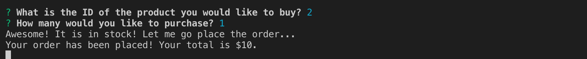

# MySQL-Mock-Store
Practice using MySQL and Node.js to create a database and interact with it using the CLI.

# What does the project do?
The first iteration of the project is the customer view. This allows the user to interact with the app through the CLI and purchase items that are in stock! The purchase removes the desired item from the database and shows the user their total at the end. If the item is not in stock, the user is notified.

# Please find a short demo of how the project functions below:
Upon load, the inventory is displayed and the user is asked what they would like to buy.


Once the user selects the item and how much they would like to buy, the user is told if their order went through and the total.




# How can users get started with the project? 
To get started, folllow the steps below:
```
git clone 'my repo'
cd MySQL-Mock-Store
npm install
node bamazonCustomer.js
```
Once the app is running, it should act just like the demo!

# Where can users get help with the project?
Please contact me directly!

# Who maintains and contributes to the project?
I am the sole contributor!
